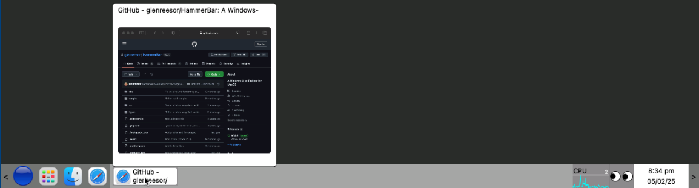

# HammerBar - A Windows-Like Taskbar for MacOS

HammerBar is a "Spoon" for [HammerSpoon](https://www.hammerspoon.org) that displays
a clickable taskbar along the bottom of your screen with support for:

- application menus
- individual application launchers
- widgets like clocks, CPU Monitor, and line graphs
- multiple monitors (separate taskbars on each monitor)



# Contents

- [Quick Start](#quick-start)
- [Widgets, Screens and BundleIds](#widgets-screens-and-bundleids)
- [Key Bindings](#keybindings)
- [Why does Hammerbar Sometimes Respond Slowly?](#why-does-hammerbar-sometimes-respond-slowly)
- [API](doc/api.md)
- [Widgets](doc/widgets.md)
- [Sample Config](doc/sample-config.md)
- [Building HammerBar](doc/building.md)

# Quick Start

- install [Hammerspoon](https://www.hammerspoon.org)
- create the directory `~/.hammerspoon/Spoons/HammerBar.spoon/`
- copy `appMenuButton.png` and `init.lua`
  from the [current release](https://github.com/glenreesor/HammerBar/releases/latest)
  to `~/.hammerspoon/Spoons/HammerBar.spoon/`
- add the following lines to `~/.hammerspoon/init.lua`:

      hs.loadSpoon("HammerBar")
      spoon.HammerBar:start()

- set your Dock to autohide, otherwise the HammerBar taskbar will be _above_ the dock.
- restart Hammerspoon

You should now have a basic taskbar. Yay!

But of course there's more. Read on....

# Widgets, Screens and BundleIds

Other than the actual taskbar, all other functionality is provided by Widgets. Widgets
are explicitly added to the Primary screen and Secondary screens using the HammerBar
API.

For example, to add a Safari launcher to the left side of the primary screen and
a clock to the right side, change your `~/.hammerspoon/init.lua` to:

```lua
hs.loadSpoon("HammerBar")

local safariLauncher = spoon.HammerBar.widgets:appLauncher('com.apple.Safari');
local clock = spoon.HammerBar.widgets.clock();

spoon.HammerBar:addWidgetsPrimaryScreenLeft({ safariLauncher });
spoon.HammerBar:addWidgetsPrimaryScreenRight({ clock });

spoon.HammerBar:start()
```

Or perhaps you want the Safari launcher only on your primary screen but the clock
on all your screens:

```lua
hs.loadSpoon("HammerBar")

local safariLauncher = spoon.HammerBar.widgets:appLauncher('com.apple.Safari');
local clock = spoon.HammerBar.widgets.clock();

spoon.HammerBar:addWidgetsPrimaryScreenLeft({ safariLauncher });
spoon.HammerBar:addWidgetsPrimaryScreenRight({ clock });
spoon.HammerBar:addWidgetsSecondaryScreenRight({ clock });

spoon.HammerBar:start()
```

## BundleIds

What the heck are BundleIds? Those are strings used by MacOS to identify applications.
For example in the examples above we used the BundleId `com.apple.Safari`.

So you want to add a different application launcher, how do you determine its
BundleId? Easy. Make sure the Hammerspoon console is open (click the Hammerspoon
icon in the MacOS menu bar and select `Console...`), then launch your application
the normal MacOS way. After it starts, Shift + Click its button in the HammerBar taskbar to
get debug information, including the BundleId, printed to the Hammerspoon console.

# Keybindings

- Command + Control + Up inside a window:
  - Vertically maximize the currently focused window
- Shift + Click a button in the taskbar:
  - Print window info to the Hammerspoon console. Use this to get the `bundleId` if you want to add the app to an App Menu
- Command or Control + Click a button in an App Menu
  - Don't hide the menu after launching the app

# Why does HammerBar sometimes respond slowly?

Good question! It will be a combination of the internal workings of Hammerspoon
(the toolkit used by HammerBar) as well as the fact that window lists are generated
by polling individual applications and window objects.

HammerBar is definitely not an optimal implementation of a MacOS taskbar, however
the use of Hammerspoon and Lua provided a pretty low bar for me to create something
that does the trick (for me, at least).

Remember that HammerBar is written in an interpreted language (Lua), it has:

- poll Hammerspoon for a list of applications
- poll every application for a list of windows
- poll every application's window to keep the status (minimized or not as well as window title)
  up to date

If you have performance suggestions drop me a note!
